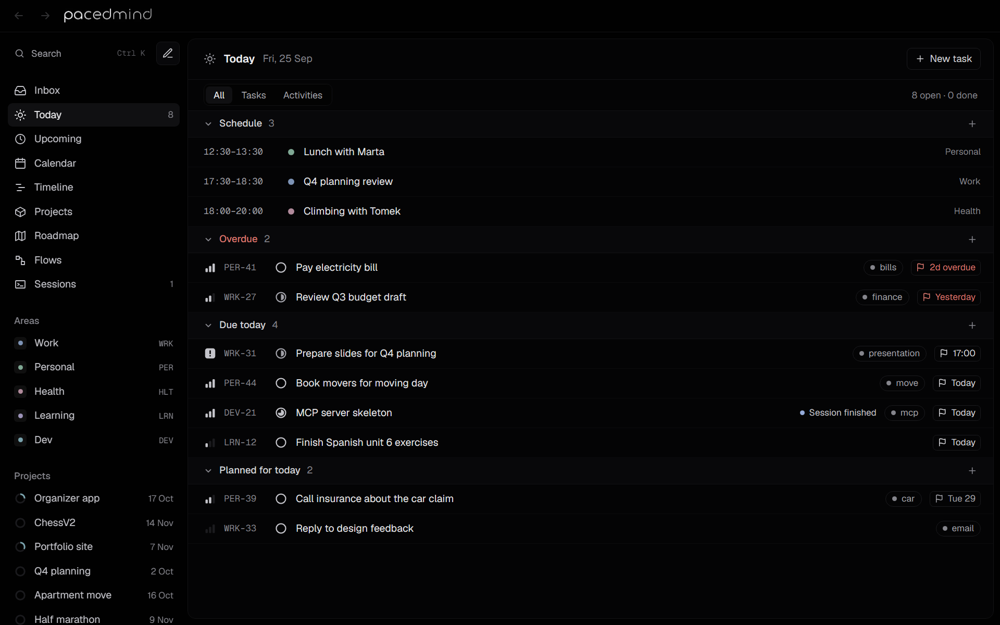

# PacedMind

A personal planner in the style of Linear: tasks, time blocks, one calendar and timeline for everything, and deadlines. It also coordinates Claude Code and Codex sessions: start a session from a task, keep talking to the agent in its own terminal, and see here when the agent says it's finished, with its report and screenshots.



[Download for Windows or macOS](https://pacedmind.com) · [Documentation](https://pacedmind.com/docs) · [Web app](https://app.pacedmind.com)

PacedMind is free on one computer and needs no account: your tasks, projects and calendar stay on that computer. [PacedMind Cloud](https://pacedmind.com/#pricing) keeps them in your account instead, for all your computers and the web app, and lets you start a session on one of your computers from another one or from your phone.

## Build from source

You need [Node.js](https://nodejs.org/) 22.13 or later.

```bash
npm install
npm run desktop
```

This builds the app, installs it and starts it. Run the same command again after changing the code: it closes the running app, replaces it and starts the new version.

- **Windows:** it installs to `%LOCALAPPDATA%\Programs\Organizer` and adds **PacedMind** to the Start Menu and the desktop. Its data and settings for this computer live in `%APPDATA%\Organizer\data`.
- **macOS:** it installs `PacedMind.app` in the Applications folder of your home folder (`~/Applications`). Its data and settings for this computer live in `~/Library/Application Support/Organizer/data`.
- It works without an account: your tasks, projects and calendar stay on this computer, in `organizer.db` in that data folder.
- To use them on other computers too, sign in to PacedMind Cloud from **Settings**. Every Cloud account uses two-factor sign-in: the first time you set up an authenticator app, and every sign-in asks for its code. **Settings → Data** then moves this computer's data into the account. Signing out goes back to this computer's own data.
- Closing the window keeps PacedMind running in the tray (the menu bar on macOS), so agents can still report back. It shows a notification when a session finishes, and when a session asked for elsewhere waits for you to allow it. Quit from the icon's menu, which also has **Start with Windows** (**Open at Login** on macOS).
- The app serves itself at http://127.0.0.1:4319. Only this computer can reach it, and only the app's own window can use it. Its sign-in, tokens and settings for this computer are encrypted with a key from the system's keychain.
- To uninstall on Windows, run `Organizer.exe --uninstall` from the install folder (removes the shortcuts and the login item), then delete the folder. On macOS, turn off **Open at Login** and move `PacedMind.app` to the Bin. Delete the data folder to remove this computer's data and settings as well; what's in your Cloud account stays there.

The installation folder, the executable, the data folder and the MCP server's name keep PacedMind's earlier name, Organizer, so updates keep the data and the agents' connections.

## Development

```bash
npm run dev
```

The dev server runs at http://127.0.0.1:4320, apart from any installed PacedMind. It prints an unlock link when it starts: open it once in your browser (only the app's own window may use it otherwise). Without an account it keeps its data in `data/organizer.db`, created with sample data on its first start. Press **C** anywhere to add a task.

Signing in uses PacedMind Cloud's Supabase project unless `.env.local` names another (see `.env.example`). For a local stack (it needs Docker):

```bash
npx supabase start
npx supabase db reset
```

`start` prints the local URL and publishable key for `.env.local`; `db reset` applies `supabase/migrations`. Then create an account and set up two-factor sign-in.

The hosted web version is the same app with `ORGANIZER_MODE=web` and `ORGANIZER_PUBLIC_ORIGIN`: every browser signs in on its own, it never starts agents, and asking a computer to start a session takes a fresh two-factor code.

[CONTRIBUTING.md](CONTRIBUTING.md) has the checks to run and how to send changes; [AGENTS.md](AGENTS.md) describes the architecture and the rules the code follows.

## Agents and MCP

The MCP server runs at `http://127.0.0.1:4319/api/mcp` in the desktop app (`4320` for the dev server) and needs a token.

- Sessions started from PacedMind (the **Start** button on a task) are connected automatically, each with its own token that works only for that session's task and stops working when its terminal closes. PacedMind opens a terminal in the task's folder with Claude Code, the task and the MCP config: a Windows Terminal tab or a Command Prompt window on Windows, a Terminal or iTerm window on macOS (**Settings → Starting sessions**).
- To use PacedMind from Claude Code sessions you start yourself, and from the Claude app, click **Connect** in **Settings → Connect your agents**. It registers the MCP server as `organizer` for all your projects with this computer's token, without showing it; `npm run connect -- --remove` undoes it. The `claude mcp add …` command in Settings does the same by hand.
- For Codex, copy the `config.toml` snippet from Settings.
- When an agent asks over MCP to start a session, PacedMind shows the request and a notification; nothing opens until you allow it.

Set each project's folder in **Settings → Projects on this computer**. Folders, the agent commands and the **Flow** switches belong to each computer, not to your account. Flows only start sessions on their own when the project's **Flow** switch is on, on that computer.

The MCP tools cover the whole app:
- areas and projects;
- tasks, with descriptions, "Done when" lists, sub-tasks, priorities, due and planned dates, and labels;
- calendar events, and moving plans between days;
- the agenda with its auto-planned focus blocks, and work hours;
- agent flows and sessions, and the reports agents hand back.

Dates can be written as `YYYY-MM-DD` or as phrases like "friday 10:00". In sessions started from PacedMind, agents can read, add tasks, update their own task and report on it, and nothing else. From your own Claude Code or Codex, deleting things, moving calendar events and starting sessions ask in the agent's terminal first, and starting a session also waits for you in PacedMind.

### Skills

`skills/` holds agent skills that teach Claude Code and Codex how to use these tools well:

- `pacedmind`: the basics.
- `pacedmind-planning`: plan a day or week, move things.
- `pacedmind-projects`: break a project down, set up agent flows.
- `pacedmind-review`: Inbox triage, the weekly review.
- `pacedmind-agent-session`: the start_task / finish_task protocol for agents working on a task, including the report and screenshots.

```bash
npm run skills
```

This installs them in `~/.claude/skills` and, when Codex is installed, in `~/.codex/skills`. Run it again after changing them. `npm run skills -- --remove` uninstalls them.

## Reports from agents

A task's **Done when** list says what must be true when it's finished, one checkable outcome per line. Add it in the task panel, or with the Done when chip when you create a task.

When an agent hands a task back, `finish_task` carries a report: a summary, a verdict (met, partly or not met) for each Done when item, screenshots, how to check the result, questions for you, and details in Markdown. Open the task, or the session in Sessions, to see it, and click a screenshot to see it full size. An agent that hands back only part of the work (partial) or gets stuck (blocked) holds its flow: nothing after it starts until you mark the task done.

If it isn't right yet, press **Request changes** under the report and write what should change. (Sessions in the Claude or Codex app, or in the cloud, take changes where they run.) The session reopens in a new terminal tab: Claude Code continues its conversation (as a new branch of it, so the old tab doesn't get in the way), and Codex starts a new one that reads its report and your changes. Either way the agent hands the task back with a new report, and the arrows on the report page through earlier ones.

Agents attach screenshots by saving an image file and passing its path (`attach_image`, or `images` in `finish_task`). PacedMind checks that it's a PNG, JPEG, GIF or WebP of up to 20 MB and keeps a copy in `attachments/` next to the database. Deleting the task deletes its images.

## Views

Today, Inbox, Upcoming, Calendar (month and week with auto-planned time blocks), Timeline, Projects, Roadmap and Flow (two views of one plan), Sessions, Computers, Settings. Pages refresh on their own when an agent changes something.

Switch between dark and light mode beside Settings in the sidebar, or in **Settings → Appearance**. The choice is remembered on this device and also updates the Windows title-bar controls.

## What's where

| Folder | What |
| --- | --- |
| `src/` | The app: Next.js pages, Server Actions, the MCP server and everything server-side (`src/server/`). |
| `desktop/` | The Electron app around it: window, tray, notifications, installer. |
| `supabase/` | PacedMind Cloud's database: migrations, row level security, and `tests/security.sql`. |
| `skills/` | The agent skills. |
| `scripts/` | Building and installing the desktop app, releases, icons, skills. |
| `site/` | The website at pacedmind.com, a separate static Next.js project ([site/README.md](site/README.md)). |
| `docs/` | The user guide at pacedmind.com/docs, a separate static Fumadocs project ([docs/README.md](docs/README.md)). |
| `deploy/` | How pacedmind.com and the web app are hosted, and how releases are published ([deploy/README.md](deploy/README.md)). |
| `public/brand/` | The wordmark and the emblem ([public/brand/README.md](public/brand/README.md)); `npm run icons` redraws the icons from them. |

## Security

PacedMind starts agents that work on your computer, so it's built to make that hard to abuse: two-factor sign-in the database itself insists on, nothing in the cloud that decides what runs on a computer, a key only the app's window holds, and a token per session that can only report on its own task. [SECURITY.md](SECURITY.md) has the details, the settings the Supabase project needs, what's left to you, and how to report a vulnerability privately.

## License

Copyright (C) 2026 NMD Mikołaj Bednarczyk and PacedMind's contributors.

PacedMind is free software: you can redistribute it and modify it under the terms of the [GNU Affero General Public License, version 3](LICENSE), as published by the Free Software Foundation. It's distributed in the hope that it will be useful, but without any warranty, without even the implied warranty of merchantability or fitness for a particular purpose. If you run a modified version for other people over a network, the license requires you to offer them its source code. To ask about other terms, write to mbednarczyk@preseed.tech.

Contributions need the [Contributor License Agreement](CLA.md) ([CONTRIBUTING.md](CONTRIBUTING.md)). The PacedMind name and logo aren't covered by the license: see [TRADEMARKS.md](TRADEMARKS.md). The icons and fonts from other projects are listed in [THIRD_PARTY_NOTICES.md](THIRD_PARTY_NOTICES.md).
